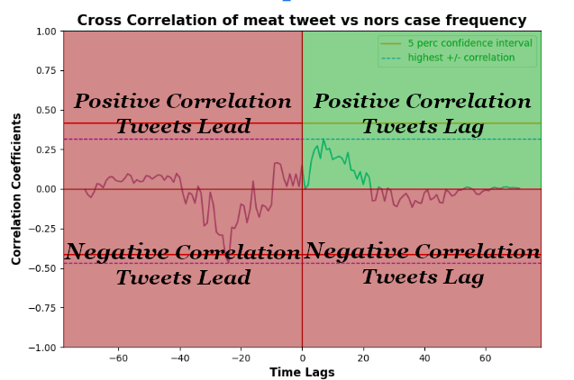

# Analysis

## Overview
The code in this repository mainly focuses on analyzing the vaibility of the pretrained bertweet model by
comparing the output of the model with the NORS dataset, assuming the NORS dataset is ground truth data.
We will specifically be examining the IFSAC food categorization scheme that the CDC has officially laid out.

All datasets are set up so that there are 2 copies, a csv and a pytorch file (.pt file).
The csv allows us to more easily view the data. The pytorch files are used in the python scripts which
are just compressed dataframes.

## Preprocessesing

Before we begin analysis we need to clean the Twitter data and NORS datasets (`filteredPositiveTweets.csv` and `NORS.xlsx` respectively).
The `listifyTweets.py` and `cleanNORS.py` scripts will clean the datasets as well as save the files as dataframes in pytorch files to be used later.

Simply run these files to produce the `cleanedFilteredPositiveTweets` and `cleanedNORSData` datasets.

## Categorize Food Preprocess

Because of lack of resources to automatically convert IFSAC food categorizations, I created a ~250 long food dictionary that
maps to categories the following food categories:
- fish
- shellfish
- dairy
- eggs
- meat
- poultry
- fruits/nuts
- vegetables
- oils/sugars
- grains/beans

The script `createCategoryJSON.py` will create the `ingredients.json` that will later map food tokens into there respective categories.
I chose the top ~250 most common food tokens present in the Twitter and NORS dataset. More food tokens can be added to this list in future
iterations.

## Categorize

The `categorizeFoodTweets.py` and `categorizeFoodNORS.py` scripts will add a column to the cleaned datasets by iterating through 
the list of food tokens, then comparing the token to the dictionary that was created in the last step. If a food token matches,
then that corresponding IFSAC food categorization will be added to a list which will be added as an attribute for that row.

These scripts create the `TweetsWithCategories` and `NORSWithCategories` datasets which will be used for the descriptive analysis 
(in the `Descriptive Analysis` directory) and the dashboard (in the `Plot` directory).

## Descriptive Analysis

Run the `descriptiveAnalysis.py` script to produce a graph of food category distribution binned by dataset. The volume is normalized
based on the total number of Tweets and NORS cases.

## Food overtime

Run the `cleanDateColumn.py` script first to prep the datetime column

Run the `binFoodOvertime.py` script to produce a food category overtime graph binned by month. The category can be change manually in 
the script in line 7. The script will then produce a cross correlation graph with lags. Each tick of lag will represent a month of lag.

The graph can be better understood with the following image:

